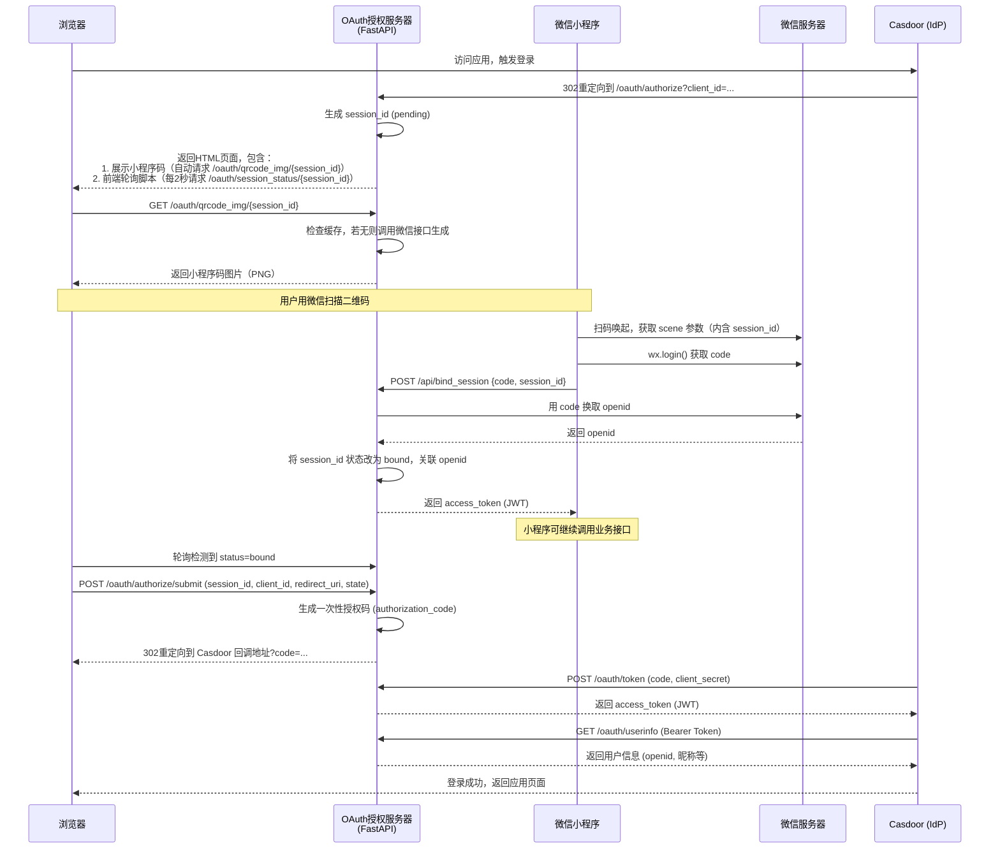
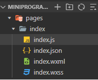
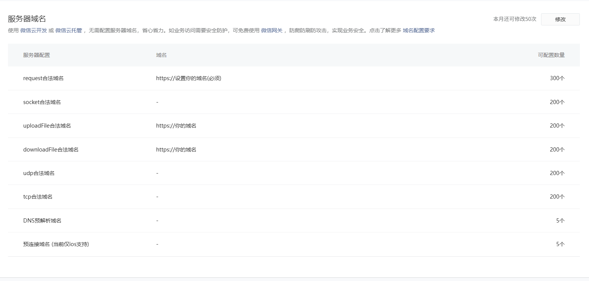
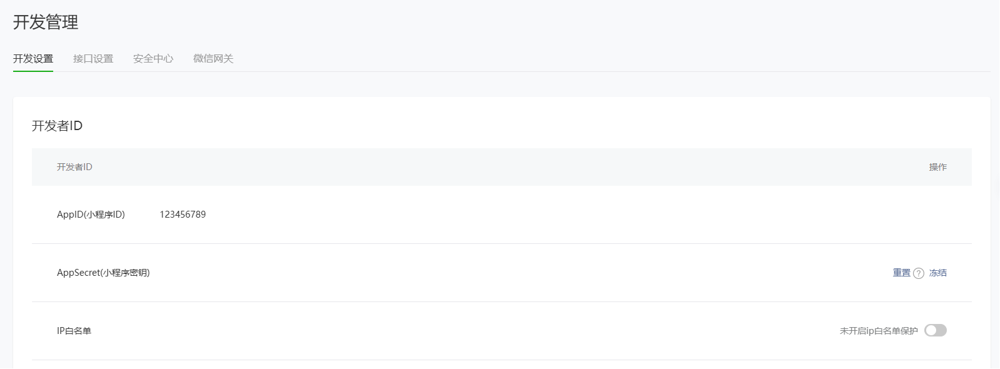
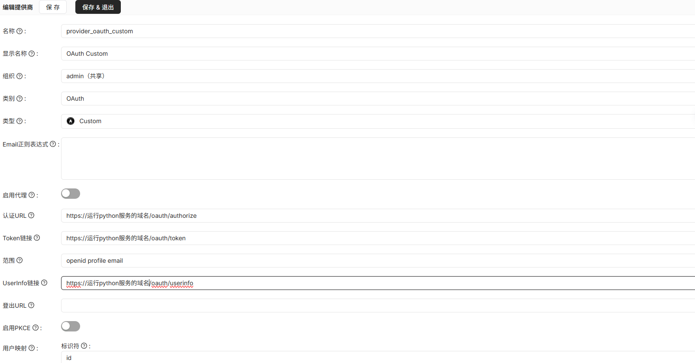
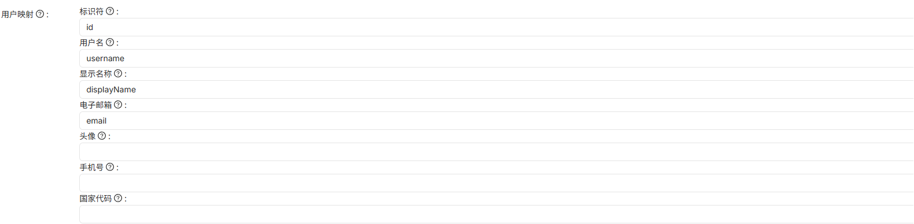
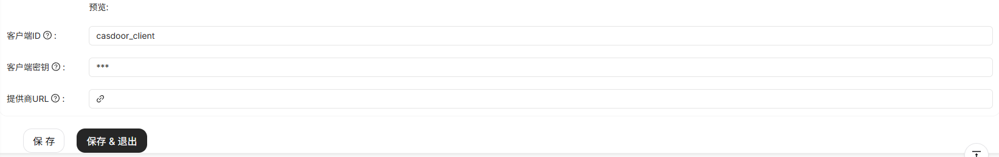

## 个人也能拥有“微信扫码登录”——基于 Casdoor 的轻量级 OAuth 方案

通过这套方案，即使使用的是普通账户（非企业认证）的小程序，也能实现和主流网站一样的“扫一扫，自动登录”体验。（注：微信官方扫码登录能力本身要求企业认证，本方案是一种轻量化的替代实现。）

github:https://github.com/ydecl/personal-wechat-auth-gateway

简单的视频演示：https://www.bilibili.com/video/BV1mjJV6qEU5/



### 小程序 + Python + Casdoor，三步搭建扫码登录

> 代码已开源在 GitHub 上，部署几乎没有门槛。小程序部分仅包含 CSS、HTML 和 JS 代码，注意：小程序正式上线仍然需要备案。

### 第一步：注册并配置小程序

首先在:[微信公众平台](https://mp.weixin.qq.com/)注册一个小程序。

进入微信小程序开发平台，随便选择一个模板即可（这里以 JS 模板为例），然后定位到 pages/index 目录。



从 GitHub 仓库获取最新的 index.js、index.wxml 和 index.wxss 代码，直接复制粘贴到对应的文件中。

*index.wxml代码可以改,改成你自己喜欢的界面。这里只是个示例,也是方便输入会话ID调试。*
比如,扫描登录失败/成功会有提示框：
>实例代码位于github仓库/微信美化实例/index.wxml

<div style="text-align: left;">
  
</div>

在 index.js 中，**务必修改代码中两处域名，确保与你在微信官方后台配置的服务器域名一致**：



```javascript
Page({
  data: {
    sessionId: '',        // 用户输入的会话ID
    hasToken: false,      // 是否已有 token
    result: '',           // 显示接口返回结果
    loginStatus: ''       // 登录状态提示
  },

  onLoad(options) {
    // 1. 首先处理从二维码（小程序码）传入的参数
    let qrSessionId = '';

    // 判断是否通过小程序码进入（参数在 options.scene 中）
    if (options.scene) {
      // scene 是经过 encodeURIComponent 编码的，需要解码一次
      qrSessionId = decodeURIComponent(options.scene);
      console.log('从小程序码获取到会话ID:', qrSessionId);
    }
    // 判断是否通过普通链接二维码进入（参数在 options.q 中）
    else if (options.q) {
      const qrUrl = decodeURIComponent(options.q);
      qrSessionId = this.getQueryParam(qrUrl, 'session_id');
      console.log('从普通二维码获取到会话ID:', qrSessionId);
    }

    // 2. 如果从二维码中成功获取到会话ID，则自动填充并登录
    if (qrSessionId) {
      // 自动填充到输入框
      this.setData({ 
        sessionId: qrSessionId,
        loginStatus: `✅ 已自动获取会话ID: ${qrSessionId}`
      });
      // 自动执行登录（无需用户点击）
      this.onLogin();
    } 
    // 3. 非扫码进入时，检查本地是否有 token
    else {
      const token = wx.getStorageSync('access_token');
      if (token) {
        this.setData({ hasToken: true });
        this.showResult('已有登录凭证，可直接调用业务接口');
      }
    }
  },

  // 辅助函数：从 URL 字符串中提取指定参数的值
  getQueryParam(url, paramName) {
    // 分离出 "?" 后面的查询字符串
    const queryString = url.split('?')[1];
    if (!queryString) return '';
    // 按 "&" 拆分每个参数
    const params = queryString.split('&');
    for (let i = 0; i < params.length; i++) {
      const [key, value] = params[i].split('=');
      if (key === paramName) {
        return decodeURIComponent(value);
      }
    }
    return '';
  },

  // 用户手动输入会话ID时触发
  onSessionIdInput(e) {
    this.setData({ sessionId: e.detail.value });
  },

  // 登录逻辑（保持不变，会自动使用 data.sessionId）
  async onLogin() {
    const sessionId = this.data.sessionId.trim();
    if (!sessionId) {
      wx.showToast({ title: '请输入会话ID', icon: 'none' });
      this.setData({ loginStatus: '❌ 请输入会话ID' });
      return;
    }

    wx.showLoading({ title: '登录中...' });
    this.setData({ loginStatus: '⏳ 正在登录...' });

    try {
      const loginRes = await wx.login();
      const code = loginRes.code;

      const res = await new Promise((resolve, reject) => {
        wx.request({
          url: 'https://你的域名/api/bind_session',   // 修改域名// 修改域名// 修改域名
          method: 'POST',
          data: { code, session_id: sessionId },
          header: { 'content-type': 'application/json' },
          success: resolve,
          fail: reject
        });
      });

      if (res.statusCode === 200 && res.data.access_token) {
        wx.setStorageSync('access_token', res.data.access_token);
        this.setData({ hasToken: true });
        wx.showToast({ title: '登录成功', icon: 'success' });
        this.showResult('✅ 登录成功！access_token 已保存');
      } else {
        throw new Error(res.data.detail || '登录失败');
      }
    } catch (err) {
      console.error(err);
      wx.showToast({ title: err.message || '登录失败', icon: 'none' });
      this.showResult(`❌ 登录失败：${err.message || '未知错误'}`);
    } finally {
      wx.hideLoading();
    }
  },

  async callBusinessApi() {
    const token = wx.getStorageSync('access_token');
    if (!token) {
      wx.showToast({ title: '请先登录', icon: 'none' });
      this.setData({ loginStatus: '⚠️ 请先登录' });
      return;
    }

    wx.showLoading({ title: '请求中...' });
    this.setData({ loginStatus: '⏳ 请求业务接口...' });

    try {
      const res = await new Promise((resolve, reject) => {
        wx.request({
          url: 'https://你的域名/api/userinfo',   // 修改域名// 修改域名// 修改域名
          method: 'GET',
          header: {
            'Authorization': `Bearer ${token}`,
            'content-type': 'application/json'
          },
          success: resolve,
          fail: reject
        });
      });

      if (res.statusCode === 200) {
        this.showResult(`✅ 业务接口返回：${JSON.stringify(res.data, null, 2)}`);
      } else {
        throw new Error(res.data.detail || '请求失败');
      }
    } catch (err) {
      console.error(err);
      wx.showToast({ title: err.message, icon: 'none' });
      this.showResult(`❌ 业务接口错误：${err.message}`);
    } finally {
      wx.hideLoading();
    }
  },

  showResult(msg) {
    this.setData({ result: msg, loginStatus: msg });
  }
});
```

### 第二步：部署 Python 后端（伪 OAuth 2.0 协议）

> 注意： 默认情况下需要使用 HTTPS 链接。在调试过程中，如果使用 HTTP，浏览器可能无法自动跳转，并会出现安全风险确认提示。

你需要准备一台服务器来运行 Python 后端。你可以选择通过反向代理将服务绑定到域名，也可以直接修改 Python 代码。

```
wget https://github.com/ydecl/personal-wechat-auth-gateway/server-oauth.py
#需要安装的库
pip install requests PyJWT fastapi uvicorn
python server-oauth.py
```

运行前，务必修改 Python 代码中的以下配置项：WX_APPID、WX_SECRET、JWT_SECRET、client_secret 以及 Casdoor 客户端相关信息。

```
# ========== 硬编码配置 ==========
WX_APPID = "你的小程序" #<-需要修改 1
WX_SECRET = "你的小程序密钥"#<-------------------------------需要修改 2 
JWT_SECRET = " 自己顺便设置个字符串别太短" #需要修改https://yc2019.cn/pages/tools/GenStr.html
JWT_EXPIRE_MINUTES = 60 * 24 * 7

# OAuth 2.0 客户端配置（与 Casdoor 中填写的 client_id/secret 一致）
OAUTH_CLIENTS = {
    "Casdoor客户端名称": {#<-------------------------------需要修改 3 
        "client_secret": "Casdoor客户端密钥",# 4 <------------需要修改
        "redirect_uris": ["https://你的Casdoor地址/callback"] #5 <-----------需要修改 
    }
}"
```

小程序 ID / 小程序密钥 查询位置：



### 第三步：配置 Casdoor

> 以下是 Casdoor 中客户端名称、密钥等信息的配置界面截图：



  

### 🔧 技术原理（极简版）

1. 网页生成一个**一次性会话ID**，同时展示包含该 ID 的小程序码。
2. 用户扫码后，小程序自动获取微信的 `code`，并连同会话 ID 一同发回你的服务器。
3. 服务器用 `code` 换取用户的 `openid`，并将其绑定到对应的会话 ID。
4. 网页通过轮询得知绑定成功，接着完成 OAuth 2.0 授权流程，用户顺利登录。

所有组件都可以运行在**一台低配 VPS** 上，甚至可以部署在本地树莓派上。

👉 如果觉得项目有帮助，欢迎 Star 支持～

现在AI这么猛，得学会抱大腿。我编程水平嘛……属于“能跑就别动”那一档，代码里肯定有不少让人扶额的地方；对微信小程序更是基本处于“它认识我、我不认识它”的状态。这个项目说白了就是个抛砖引玉的思路，欢迎哪位大神看不过眼，顺手把它进化成一个真正能打的产品。顺带一提，这玩意儿部署起来，大概率是运维小伙伴看了会沉默、想打人那种，但只要能跑起来，就说明——至少在此时此刻，这世上还是多了一个属于我自己的“乞丐版单点登录”。

赞助
<div style="text-align: left;">
  
</div>
